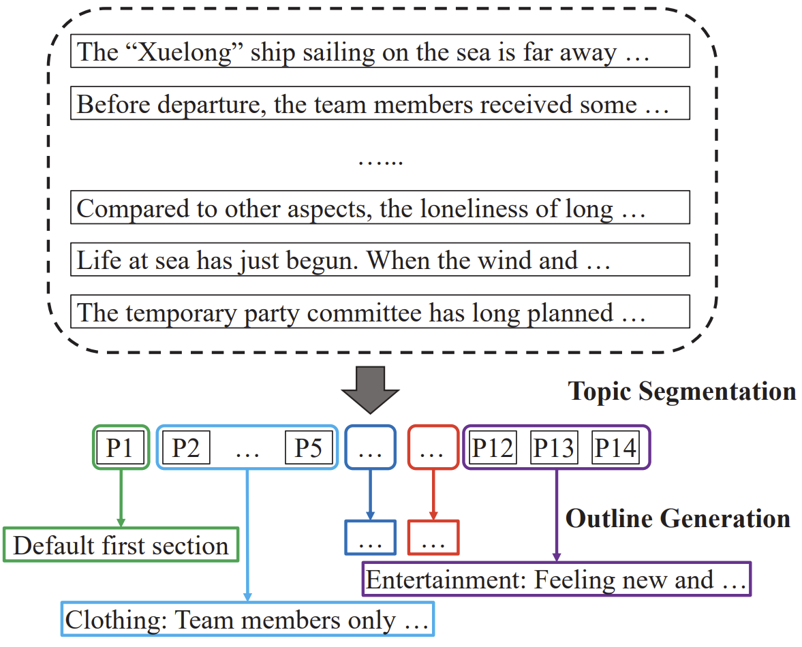
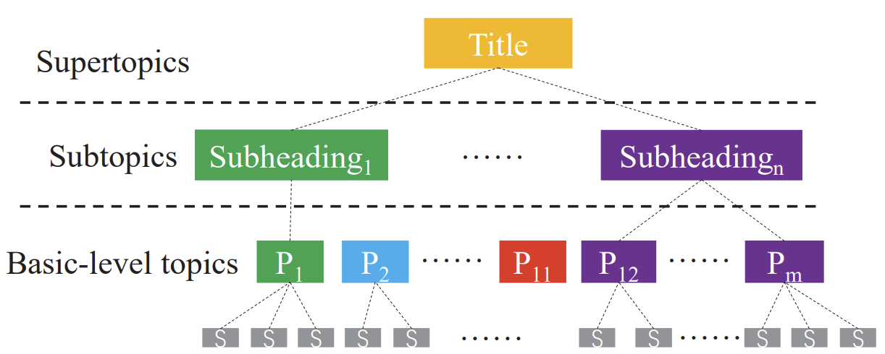
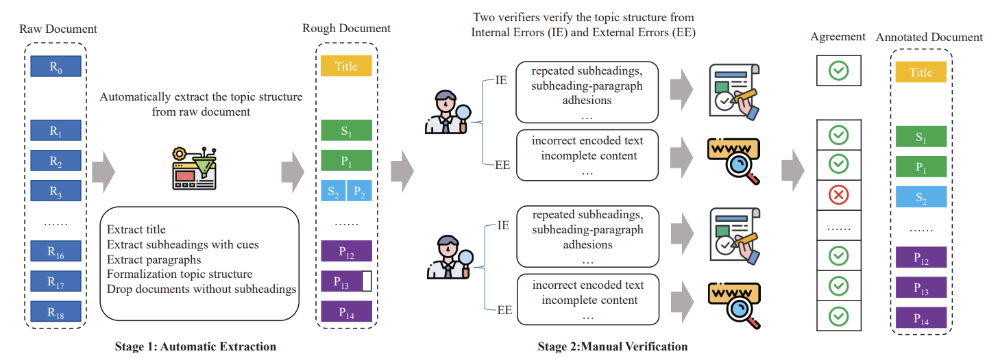
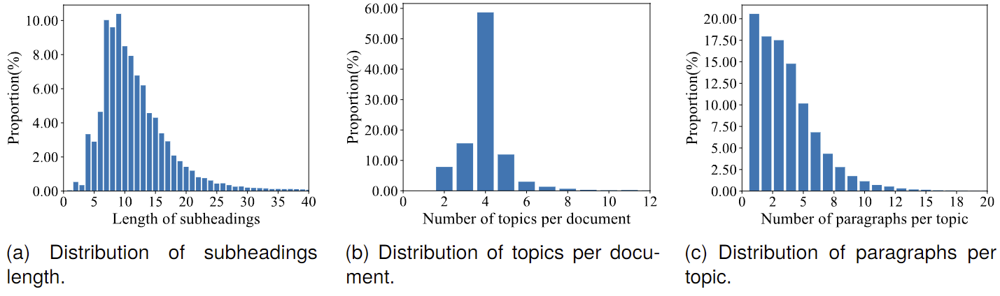

# The repository for Advancing Topic Segmentation and Outline Generation in Chinese Texts: The Paragraph-level Topic Representation, Corpus, and Benchmark

# ✨ Latest News
*   [03/26/2024]: Release the CPTS dataset.
*   [05/24/2023]: Release the [tech report](https://arxiv.org/abs/2305.14790).


# ⚡ Introduction
Welcome to the repository of CPTS!

Topic segmentation and outline generation strive to divide a document into coherent topic sections and generate corresponding subheadings, unveiling the discourse topic structure of a document. Compared with sentence-level topic structure, the paragraph-level topic structure can quickly grasp and understand the overall context of the document from a higher level, benefitting many downstream tasks such as summarization, discourse parsing, and information retrieval. However, the lack of large-scale, high-quality Chinese paragraph-level topic structure corpora restrained relative research and applications. To fill this gap, we build the Chinese paragraph-level topic representation, corpus, and benchmark in this paper. Firstly, we propose a hierarchical paragraph-level topic structure representation with three layers to guide the corpus construction. Then, we employ a two-stage man-machine collaborative annotation method to construct the largest Chinese Paragraph-level Topic Structure corpus (CPTS), achieving high quality. We also build several strong baselines, including ChatGPT, to validate the computability of CPTS on two fundamental tasks (topic segmentation and outline generation) and preliminarily verified its usefulness for the downstream task (discourse parsing).


Fig. 1 The demo of topic segmentation and outline generation.

# 🎯 CPTS Dataset

## Representation

A proper topic structure representation is a prerequisite and necessary condition for guiding the construction of a topic corpus. It determines the form and content of corpus annotation. Most of the existing corpora only annotate basic units and topics they subordinate. Recent work has gradually enriched annotations, such as using keywords and phrases to annotate topic content. However, at the paragraph level, as the granularity becomes larger, richer annotations are needed to comprehensively express the high-level structure of the document, such as subheadings and titles.

Recognizing this, we propose a three-layer hierarchical representation of the Chinese paragraph-level topic structure for guiding corpus construction according to discourse topic theories: **supertopics**, **subtopics**, and **basic level topics**. It not only includes paragraph boundaries and topic boundaries but also includes topic content and the higher-level title of a document. In particular, we regard the subheading and title as a clause or sentence instead of keywords to represent richer information on the paragraph level.

Specifically, we take the document's title as a supertopic, subheadings as subtopics, and paragraphs as basic-level topics, which implies a single paragraph will belong to one topic, and consecutive paragraphs describing the same topic fall under the same subheading. All subheadings, in turn, are subordinate to the title as subtopics. This hierarchical topic structure can capture relationships not only between paragraphs and subheadings but also between subheadings and the title. 


Fig. 2 The Chinese paragraph-level topic structure representation.


In addition, we use subheadings (clauses or sentences) instead of noun phrases to represent subtopics of longer basic units (paragraphs), overcoming the limitation of keywords or phrases as subtopics that limit the amount of information conveyed by the topic at the paragraph level (the subtopic only has 4.7 tokens in latest work). By integrating the semantic richness of subheadings, we can better capture the nuances of the document's content and structure.

## Annotation


Fig. 3 The annotation framework of CPTS.

### Data Source
Although our proposed representation model can be applied to various genres of documents, we still want to construct the corresponding corpus from more general text to assist downstream tasks better. Therefore, we select the news documents issued by Xinhua News Agency from Chinese Gigaword Fourth Edition (Gigaword corpus) as the data source for generalization. It contains 1373448 news documents of four types (i.e., advis, multi, other and story) from January 1991 to December 2008. We chose story news as candidate documents because they account for most of them (1314198/1373448) and are more standardized than the other three types of news, which is conducive to building a more generalized topic structure.


### Man-machine Collaborative Annotation
Manually constructing topic structure corpora is time-consuming and limited in scale due to topic ambiguities, while large-scale corpora constructed by automatic extraction without manual verification do not guarantee the correctness of topic boundaries and content in semantics that are essential for finer tasks such as outline generation. Thus, inspired by previous work on automatic and manual construction, we design a two-stage man-machine collaborative annotation strategy involving both automatic extraction and manual verification to build a large-scale and high-quality corpus.

The details of our two-stage man-machine collaborative annotation process are shown in Figure 3. In the first stage, we take several steps to automatically extract candidate documents with topic structures, ensuring the correctness of topic boundaries and contents in terms of form. In the second stage, each document is double-checked for internal and external errors by two human validators to ensure the correctness of topic boundaries and contents in terms of semantics. 

###  Automatic Extraction

Following previous work, we automatically extracted the topic structure of the document in the first stage. Different from easily extracting topic structure from structured text in WIKI, news text is harder because it is typically composed of unstructured paragraphs with natural texts. Therefore, we designed a heuristic automatic extraction method to extract topic structures from raw documents automatically. Firstly, we extract the first paragraph that only includes one sentence and without ending punctuation as the title of a document. Then, we traverse the following paragraphs in the documents. If a paragraph has only one sentence and has a special token "(subheading)", we regard it as a subheading. Otherwise, it will be added to the paragraph list. After traversing all paragraphs, we formalize the topic structure representation based on the position of the paragraphs and subheadings and drop the document that does not contain any subheadings. This automatic extraction method can quickly extract topic structures from a large number of documents, but due to its simple heuristic rules, the accuracy cannot be guaranteed. Therefore, we take the second stage of manual verification to make it up.


### Manual Verification
Hearst pointed out that most documents do not contain explicit subheadings that indicate the topic structure. Therefore, after the first stage, we obtain 14393 (about 1\% of raw documents) rough documents containing subheadings extracted automatically since few documents explicitly have two or more subheadings with special   tokens in the Gigaword corpus. To ensure the correctness of topic boundaries and content in terms of semantics, we ask verifiers to verify the topic structure of each rough document. Our verification team consists of one Ph.D. student, six master's students, and one senior undergraduate student, all of whom are engaged in natural language processing. They are divided into four groups, and each document will be verified by one group (two verifiers) to ensure the objectivity and accuracy of verification. It is worth mentioning that since the sub-topics are automatically extracted in the first stage, the verifier simply needs to check the correctness of paragraphs, subheadings, and title rather than label boundaries and write topic contents, which significantly reduces the annotation effort. 

Manual verification mainly verifies the correctness of automatic extraction from a semantic perspective at this stage and also quickly re-verifies the form correctness of topic boundaries that have been automatically extracted. For semantic issues, they are mainly checked from both internal and external errors. Internal errors refer to errors that verifiers can correct through the document itself, including repeated subheadings, title-paragraph adhesions, etc. For external errors such as incorrect encoded text or incomplete content in some subheadings or paragraphs that cannot be fixed from the document itself, verifiers use the help of search engines to retrieve the source news and make corresponding modifications.


During the second verification stage, two verifiers in each group verify the documents separately. When two verifiers have a conflict in their annotations, they discuss resolving. Finally, 36\% of documents containing errors are revised by our verifiers. Thanks to the automatic extraction of most of the correct topic structures in the first stage, the average Inter-Annotator Agreement (IAA) between two verifiers of the same group is 94.79\%, and the Kappa value between them is 0.849. It demonstrates that our two-stage man-machine collaborative annotation method only requires the verifier to validate the topic structure rather than directly generate it, significantly reducing the workload while maintaining high quality. 

## Analysis

| **Item**                   | **Max** | **Min** | **Avg.**  |
|----------------------------|---------|---------|-----------|
| # words/document           | 5791    | 180     | 1727.96   |
| # paragraphs/document      | 40      | 2       | 14.76     |
| # words/subheading         | 147     | 1       | 12.33     |
| # paragraphs/subheading    | 33      | 1       | 3.70      |
| # subheadings/document     | 20      | 2       | 4.00      |

Table 1. The static of CPTS.


The details of CPTS are shown in Table 1, the range and average figures for various aspects like the number of words per document (ranging from 180 to 5791, with an average of 1727.96), paragraphs per document (ranging from 2 to 40, averaging at 14.76), words per subheading (averaging at 3.70) and subheadings per document (ranging from 2 to 20, with an average of 4.00). Furthermore, Figure 4 depicts the main distributions of the length of subheadings, topics per document, and paragraphs per topic. Figure 4a shows that about 90\% subheadings have more than seven words, and only a few subheadings have less than four words. It shows that subheadings in CPTS are usually clauses or sentences rather than words or phrases, which could fully express the information of a paragraph-level topic.  Figure 4b shows that about 60\% of the documents have four topics, demonstrating the topic granularity will change with the document length. We also notice that over 70\% of topics contain less than four paragraphs in Figure 4c. They indicate the usefulness of the paragraph-level topic: A document can be divided into two more simple structures through paragraph-level topics (the discourse structure among paragraph-level topics and that in one topic).


Fig. 4 The distribution of subheadings length, topics per document, and paragraphs per topic in CPTS.


Please refer to [tech report](https://arxiv.org/abs/2305.14790) for more details.


# 📩 Contact
If you have any questions, please feel free to [contact](jeffreyjiang@cuhk.edu.cn) me. 

# Citation
```
@inproceedings{jiang-etal-2024-advancing-topic,
    title = "Advancing Topic Segmentation and Outline Generation in {C}hinese Texts: The Paragraph-level Topic Representation, Corpus, and Benchmark",
    author = "Jiang, Feng  and
      Liu, Weihao  and
      Chu, Xiaomin  and
      Li, Peifeng  and
      Zhu, Qiaoming  and
      Li, Haizhou",
    editor = "Calzolari, Nicoletta  and
      Kan, Min-Yen  and
      Hoste, Veronique  and
      Lenci, Alessandro  and
      Sakti, Sakriani  and
      Xue, Nianwen",
    booktitle = "Proceedings of the 2024 Joint International Conference on Computational Linguistics, Language Resources and Evaluation (LREC-COLING 2024)",
    month = may,
    year = "2024",
    address = "Torino, Italia",
    publisher = "ELRA and ICCL",
    url = "https://aclanthology.org/2024.lrec-main.44",
    pages = "495--506",
    abstract = "Topic segmentation and outline generation strive to divide a document into coherent topic sections and generate corresponding subheadings, unveiling the discourse topic structure of a document. Compared with sentence-level topic structure, the paragraph-level topic structure can quickly grasp and understand the overall context of the document from a higher level, benefitting many downstream tasks such as summarization, discourse parsing, and information retrieval. However, the lack of large-scale, high-quality Chinese paragraph-level topic structure corpora restrained relative research and applications. To fill this gap, we build the Chinese paragraph-level topic representation, corpus, and benchmark in this paper. Firstly, we propose a hierarchical paragraph-level topic structure representation with three layers to guide the corpus construction. Then, we employ a two-stage man-machine collaborative annotation method to construct the largest Chinese Paragraph-level Topic Structure corpus (CPTS), achieving high quality. We also build several strong baselines, including ChatGPT, to validate the computability of CPTS on two fundamental tasks (topic segmentation and outline generation) and preliminarily verified its usefulness for the downstream task (discourse parsing).",
}
```
We are from the School of Data Science, the Chinese University of Hong Kong, Shenzhen (CUHKSZ), and the Shenzhen Research Institute of Big Data (SRIBD).
